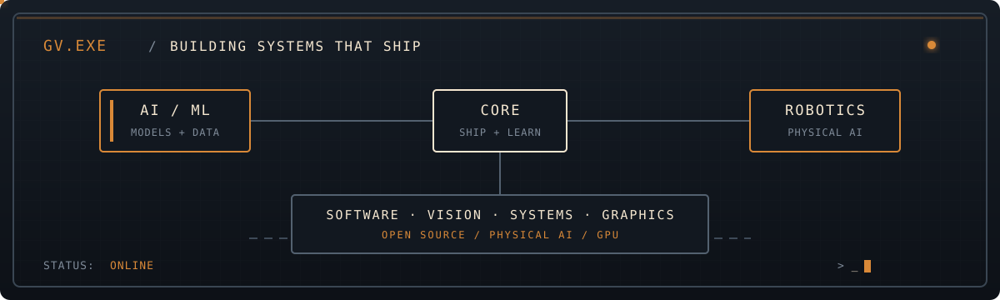
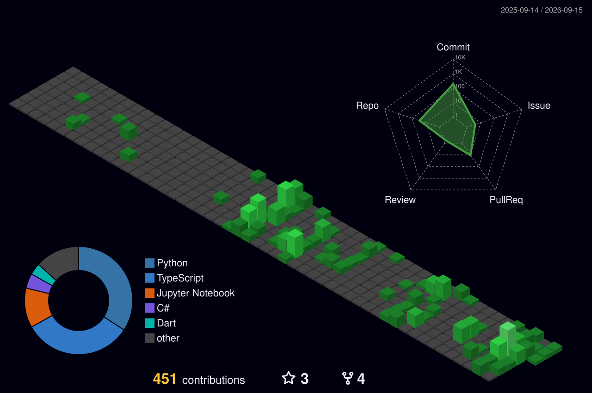

<div align="center">

<a href="https://github.com/Galabavamsi">
  
</a>

**Mechatronics undergraduate at IIT Bhilai** building across software engineering, AI/ML, computer vision, wireless systems, and GPU graphics.

[portfolio](https://galabavamsi.github.io/portfolio/) · [resume](https://galabavamsi.github.io/portfolio/resume_vamsi.pdf) · [LinkedIn](https://linkedin.com/in/galaba-vamsi-334758211) · [email](mailto:galabavamsi12@gmail.com) · [Human Slop](https://humanslop.in)

</div>

---

## Now

```text
FOCUS       software engineering · AI/ML research · computer vision · systems
BUILDING    Human Slop — an authenticity-first anti-AI social platform (2026–present)
OPEN TO     engineering and research roles where prototypes become products
OPEN SOURCE 5 merged HFlow PRs · HFlow issue #365 resolved · 1 inspect-robots PR awaiting approval
```

## Open source

### [HFlow](https://github.com/Hebbian-Robotics/hflow) · [Hebbian Robotics (YC S26)](https://www.ycombinator.com/companies/hebbian-robotics)

Open-source robotics data processing and evaluation framework · **5 merged PRs** · **issue #365 resolved by PR #367**

<details open>
<summary>Contribution log</summary>

- [PR #367 · merged · featured](https://github.com/Hebbian-Robotics/hflow/pull/367) · [issue #365](https://github.com/Hebbian-Robotics/hflow/issues/365) — Added a reproducible cold `camera_frame_stats` evidence benchmark with separate transform timing, fresh episode workdirs, and FFmpeg/CPU provenance reporting; resolved the issue without changing the shipped filter graph.
- [PR #362 · merged](https://github.com/Hebbian-Robotics/hflow/pull/362) — Matched saved EgoSuite labels by HFlow source provenance instead of basenames, preserving unambiguous legacy reports and rejecting ambiguous matches.
- [PR #360 · merged](https://github.com/Hebbian-Robotics/hflow/pull/360) · [issue #314](https://github.com/Hebbian-Robotics/hflow/issues/314) — Centralized ingest URI parsing across the CLI, server, and SDK with shared trimming and safety checks; normalized safe relative URIs and rejected blank, absolute, and parent-escaping paths.
- [PR #353 · merged](https://github.com/Hebbian-Robotics/hflow/pull/353) · [issue #292](https://github.com/Hebbian-Robotics/hflow/issues/292) — LeRobot video-cache filenames omitted the video file index; included the camera key, video chunk index, and video file index in cache identity and bumped the converter version to invalidate stale outputs.
- [PR #350 · merged](https://github.com/Hebbian-Robotics/hflow/pull/350) · [issue #296](https://github.com/Hebbian-Robotics/hflow/issues/296) — LeRobot’s Hugging Face tree discovery stopped after the first API page; added paginated traversal via `Link: rel="next"`, preserved request headers, deduplicated paths, rejected unsafe cross-origin links, and prevented pagination loops.

</details>

### [Inspect Robots](https://github.com/robocurve/inspect-robots) · [Robocurve (YC Summer 2026)](https://www.ycombinator.com/companies/robocurve)

MIT-licensed open-source evaluation framework for physical AI · **1 PR awaiting approval**

<a href="https://robocurve.org/">Robocurve</a> is a San Francisco Public Benefit Corporation building open-source tools and independent benchmarks for physical AI.

[PR #434 · awaiting approval](https://github.com/robocurve/inspect-robots/pull/434) — Added a first-party `inspect-robots-wandb` plugin with a `WandbSink` for recording evaluation configuration and final aggregate metrics in one Weights & Biases run per evaluation.


## Selected work

| Project | What I built |
|---|---|
| [Human Slop](https://humanslop.in) | Anti-AI social platform centered on manual writing, behavioral typing signals, and authenticity-first interaction. |
| [Arista Wi-Fi RRM](https://canva.link/puoqbe4okoid8rb) | Client-aware NS-3 RRM with 3 RF metrics, 100,000-sample I/Q captures, 16-class Dual-CNN inference, and a 5-AP / 50-client topology. |
| [AntennaNet](https://github.com/Galabavamsi/Antenna-Net) | Inverse EM design tooling with KD-tree anchoring across 144D antenna search spaces. |
| [Electron-GNN](https://github.com/Galabavamsi/Electron-GNN) | Two-tower GATv2 model for predicting molecular absorption spectra from geometry. |
| [RIS Simulator](https://github.com/Galabavamsi/RIS-SIM) | Zero-budget open-source emulator for smart radio environments and USRP-like LoS/NLoS behavior. |
| [Open-PyFX](https://github.com/Galabavamsi/open-pyfx) | GPU-accelerated video effects for CRT emulation, ASCII edge detection, and 3D LUT pipelines. |

<details>
<summary><strong>Toolbox</strong></summary>

```text
LANGUAGES   Python · C/C++ · TypeScript · JavaScript · Kotlin · Swift · Dart · Go · GLSL · CUDA
AI / ML     PyTorch · GNNs · Safe RL · Transformers · OpenCV · CuPy
PRODUCT     React · React Native · Flutter · Node.js · PostgreSQL · AWS · Supabase
SYSTEMS     Git · Linux · GitHub Actions · CI/CD · ROS 2 · MEEP · OpenMPI · SDR/USRP
```

</details>

<details>
<summary><strong>Experience & research</strong></summary>

- Marketing Intern, Swiggy Ltd - Campus CEO project, May-July 2024; managed a campaign with 15 social media posts and contributed to campus marketing initiatives and execution.
- Research intern at IIT Bhilai on 6G RIS simulation and testbed development, May–August 2025.
- First-author work: *An Open Emulator for Smart Radio Environments*.
- 5th rank at the Arista Networks Wi-Fi Optimization Challenge, Inter IIT Tech Meet 14.0.
- Top 3.5% in the Amazon ML Challenge; accepted into YC Startup School with Human Slop.

</details>

## GitHub activity

<div align="center">

<a href="https://github.com/Galabavamsi">
  
</a>

</div>

---

<div align="center">

`build → measure → learn → ship`

</div>
