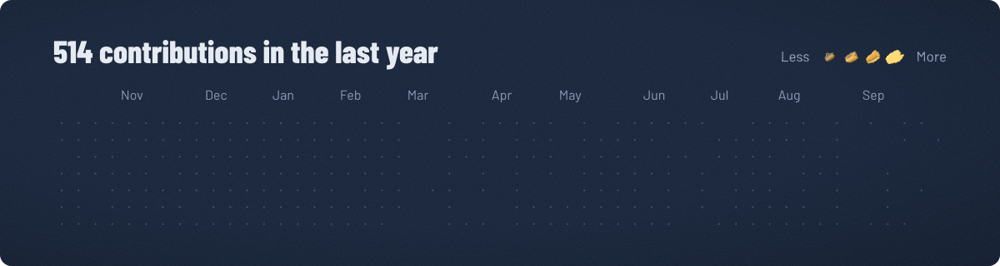

<a href="https://galabavamsi.github.io/portfolio/">
  
</a>

Most of my open-source work sits in the robotics stack: data processing in [HFlow](https://github.com/Hebbian-Robotics/hflow), evaluation in [Inspect Robots](https://github.com/robocurve/inspect-robots), and the runtime in [Cerulion](https://github.com/cerulion-inc/cerulion). Outside it, I co-founded [Human Slop](https://humanslop.in), a social platform for writing that people actually type themselves, and I research simulators for 6G smart radio environments.

[Portfolio](https://galabavamsi.github.io/portfolio/) · [Resume](https://galabavamsi.github.io/portfolio/resume_vamsi.pdf) · [LinkedIn](https://www.linkedin.com/in/galabavamsi/) · [Google Scholar](https://scholar.google.com/citations?user=UNjZa1sAAAAJ&hl=en) · [Email](mailto:galabavamsi12@gmail.com) · [X](https://x.com/Galaba_Vamsi) · [YouTube](https://www.youtube.com/@galabavamsi12)

## Now

- Building [Human Slop](https://humanslop.in), live on the web and [Android](https://play.google.com/store/apps/details?id=com.humanslop.app).
- Three Inspect Robots PRs in review, including crash-safe checkpoint and resume for long robot eval sets.
- Co-authoring the Inspect Robots paper, submitted to the CoRL 2026 SPAIS workshop.
- Open to engineering and research roles where prototypes become products.

## Open source


### [HFlow](https://github.com/Hebbian-Robotics/hflow) · [Hebbian Robotics (YC S26)](https://www.ycombinator.com/companies/hebbian-robotics)

Open-source robotics data processing and evaluation framework · **8 merged PRs**

My work there is conversion correctness: robot logs and LeRobot datasets should come through HFlow whole, or be refused with a clear reason. Never silently lose a field, a depth channel, or a file.

| Area | What shipped |
|---|---|
| **Episode schema** | Arrow columns typed from every message, so fields that appear after startup survive ([#657](https://github.com/Hebbian-Robotics/hflow/pull/657), closes [#656](https://github.com/Hebbian-Robotics/hflow/issues/656)); sources with several channels on one topic refused before episode creation ([#598](https://github.com/Hebbian-Robotics/hflow/pull/598)) |
| **LeRobot import** | Depth videos refused before the RGB path drops 12-bit depth ([#400](https://github.com/Hebbian-Robotics/hflow/pull/400)); paginated Hugging Face tree discovery ([#350](https://github.com/Hebbian-Robotics/hflow/pull/350)); cache keys that include the video file index ([#353](https://github.com/Hebbian-Robotics/hflow/pull/353)) |
| **Ingest safety** | One URI validator shared by the CLI, server, and SDK ([#360](https://github.com/Hebbian-Robotics/hflow/pull/360)); EgoSuite labels matched by source provenance instead of basenames ([#362](https://github.com/Hebbian-Robotics/hflow/pull/362)) |
| **Evidence** | Reproducible cold 1080p30 benchmark, 3 runs of 900 frames, 4.897 s median; no safe speedup found, so the filter graph stayed as shipped ([#367](https://github.com/Hebbian-Robotics/hflow/pull/367)) |

<details>
<summary><b>Full HFlow contribution log (8 merged)</b></summary>

- [PR #657 · merged · latest](https://github.com/Hebbian-Robotics/hflow/pull/657) · [issue #656](https://github.com/Hebbian-Robotics/hflow/issues/656) — Types Arrow columns from every message, preserving fields introduced after startup and reporting incompatible shapes with topic and field context.
- [PR #598 · merged](https://github.com/Hebbian-Robotics/hflow/pull/598) · [issue #597](https://github.com/Hebbian-Robotics/hflow/issues/597) — Refused sources with multiple channels on one topic before canonical episode creation, added `hflow doctor` diagnostics for the unsupported shape, and bumped `TRANSFORM_BEHAVIOR_VERSION` to `10`.
- [PR #400 · merged](https://github.com/Hebbian-Robotics/hflow/pull/400) · [issue #399](https://github.com/Hebbian-Robotics/hflow/issues/399) — Refused LeRobot depth videos before conversion when depth markers were present, preventing the RGB H.264 path from silently losing 12-bit depth semantics while preserving the existing RGB path.
- [PR #367 · merged · featured](https://github.com/Hebbian-Robotics/hflow/pull/367) · [issue #365](https://github.com/Hebbian-Robotics/hflow/issues/365) — Added a reproducible cold `camera_frame_stats` evidence benchmark: 3 cold 1080p30 checks, 900 decoded frames each, and a 4.897 s median; separated transform timing and provenance, and documented that no repeatable semantics-preserving speedup was demonstrated, so the shipped filter graph stayed unchanged.
- [PR #362 · merged](https://github.com/Hebbian-Robotics/hflow/pull/362) — Matched saved EgoSuite labels by HFlow source provenance instead of basenames, preserving unambiguous legacy reports and rejecting ambiguous matches.
- [PR #360 · merged](https://github.com/Hebbian-Robotics/hflow/pull/360) · [issue #314](https://github.com/Hebbian-Robotics/hflow/issues/314) — Centralized ingest URI parsing across the CLI, server, and SDK with shared trimming and safety checks; normalized safe relative URIs and rejected blank, absolute, and parent-escaping paths.
- [PR #353 · merged](https://github.com/Hebbian-Robotics/hflow/pull/353) · [issue #292](https://github.com/Hebbian-Robotics/hflow/issues/292) — LeRobot video-cache filenames omitted the video file index; included the camera key, video chunk index, and video file index in cache identity and bumped the converter version to invalidate stale outputs.
- [PR #350 · merged](https://github.com/Hebbian-Robotics/hflow/pull/350) · [issue #296](https://github.com/Hebbian-Robotics/hflow/issues/296) — LeRobot's Hugging Face tree discovery stopped after the first API page; added paginated traversal via `Link: rel="next"`, preserved request headers, deduplicated paths, rejected unsafe cross-origin links, and prevented pagination loops.

</details>

### [Inspect Robots](https://github.com/robocurve/inspect-robots) · [Robocurve (YC Summer 2026)](https://www.ycombinator.com/companies/robocurve)

MIT-licensed evaluation framework for robot AI ("Inspect AI for robotics") · **2 merged, 3 open, 1 package on PyPI**

[Robocurve](https://robocurve.org/) is a San Francisco public benefit corporation building open-source tools and independent benchmarks for physical AI. Every PR clears 100% coverage, strict mypy, and ruff in CI.

- **[inspect-robots-wandb](https://pypi.org/project/inspect-robots-wandb/)** · [source](https://github.com/Galabavamsi/inspect-robots-wandb) — Weights & Biases logging sink: one W&B run per evaluation with the full eval spec, trial counts, and every aggregate metric. Started as PR #434 and moved to its own package at the maintainers' request; 100% coverage, CI on Python 3.10 to 3.13, PyPI trusted publishing.
- [PR #476 · merged](https://github.com/robocurve/inspect-robots/pull/476) · [issue #441](https://github.com/robocurve/inspect-robots/issues/441) — Configurable LLM retry policy across five wire protocols, honoring `Retry-After` (seconds and HTTP-date) with exponential backoff fallback, recorded in the eval log.
- [PR #475 · merged](https://github.com/robocurve/inspect-robots/pull/475) · [issue #473](https://github.com/robocurve/inspect-robots/issues/473) — Stopped an unknown working-tree state from being logged as a verified-clean commit SHA.
- [PR #514 · open](https://github.com/robocurve/inspect-robots/pull/514) · [issue #136](https://github.com/robocurve/inspect-robots/issues/136) — Checkpoint and resume for long eval sets on robot hardware: single-writer manifest, immutable per-attempt logs, in-flight markers, and safety aborts that are never auto-retried (about 4,100 lines with tests).
- [PR #550 · open](https://github.com/robocurve/inspect-robots/pull/550) — Optional `on_eval_error` sink hook; approved by the automated reviewer, awaiting a maintainer.
- [PR #551 · open](https://github.com/robocurve/inspect-robots/pull/551) — Community plugins section in the plugin guide.

### [Cerulion](https://github.com/cerulion-inc/cerulion)

Open-source robot runtime with ROS 2 interoperability · **5 merged PRs**

- [PR #216 · merged](https://github.com/cerulion-inc/cerulion/pull/216) · issue #53 — `ros2 attach --dry-run` runs outside a workspace using an exclusively created temp root with RAII cleanup, so a pre-planted directory cannot change the report.
- [PR #226 · merged](https://github.com/cerulion-inc/cerulion/pull/226) · issue #71 — Documented the fail-closed arm of the `CERULION_NETWORK` kill-switch; review surfaced a real gap, filed as issue #239.
- [PR #224](https://github.com/cerulion-inc/cerulion/pull/224), [#222](https://github.com/cerulion-inc/cerulion/pull/222), [#220](https://github.com/cerulion-inc/cerulion/pull/220) · merged — Fixed 21 stale `USER_API.md` references across 11 files, ASCII punctuation in shipped doc comments, and misleading workspace-root comments in `cerulion_cli_engine`.

## Research

- **First author.** *An Open Emulator for Smart Radio Environments* ([paper](https://drive.google.com/file/d/12oDPsflaUXKnSjfA3247HgFDDf4bJkCP/view?usp=drive_link)), from my 6G RIS research internship at IIT Bhilai, May to August 2025.
- **Co-author.** *Experience with RF Energy Harvesting-Driven Self-Powered RIS*, IEEE INDICON 2025 ([IEEE Xplore](https://ieeexplore.ieee.org/abstract/document/11392908/)).
- **Co-author.** *A systematic literature review on simulation models and deployments for reconfigurable intelligent surfaces* ([ScienceDirect](https://www.sciencedirect.com/science/article/pii/S1570870526001964)).
- **Co-author, under review.** *Inspect Robots: Evaluating the Capabilities and Safety of Embodied AI*, CoRL 2026 Workshop SPAIS.

[Google Scholar](https://scholar.google.com/citations?user=UNjZa1sAAAAJ&hl=en) · [ResearchGate](https://www.researchgate.net/profile/Galaba-Vamsi) · [IEEE Xplore](https://ieeexplore.ieee.org/author/943675488152924)

## Selected work

| Project | What I built |
|---|---|
| [Human Slop](https://humanslop.in) | Anti-AI social platform on web and Android, built on manual writing, real-time typing forensics, and hardware-bound biometric sign-in. |
| [Charter](https://github.com/Galabavamsi/charter) | Agentic commerce prototype: chat, voice, and MCP doors (10 MCP tools) sharing one bounded Razorpay test-mode payment core. |
| [Pneumatic Sorting Digital Twin](https://github.com/Galabavamsi/pneumatic-sorting-digital-twin) | Open-source Unity digital twin for modular electropneumatic sorting and stamping, with HMI flows, telemetry, and replay. |
| [RIM-SIM v2](https://github.com/Galabavamsi/RIM-SIM-V2) | Zero-budget emulator for smart radio environments with USRP-style interfaces: 6 LoS/NLoS scenarios, a 20 Hz WebSocket feed, 103 tests. |
| [Arista Wi-Fi RRM](https://canva.link/puoqbe4okoid8rb) | Client-aware NS-3 RRM: 3 RF metrics, 100,000 I/Q samples into 16 classes with a Dual-CNN, 5 APs and 50 clients. 5th at Inter IIT 14.0. |
| [Electron-GNN](https://github.com/Galabavamsi/Electron-GNN) | Two-tower GATv2 model that predicts molecular absorption spectra from geometry. |
| [AntennaNet](https://github.com/Galabavamsi/Antenna-Net) | Inverse EM design with KD-tree spectral anchoring across 144-dimensional antenna search spaces. |
| [Open-PyFX](https://github.com/Galabavamsi/open-pyfx) | GPU video effects in Python and GLSL: CRT emulation, ASCII edge detection, 3D LUTs, 4K export. |
| [Lunar Crater Detection](https://github.com/Galabavamsi/Moon-Crater-Detection-using-DEM) | Crater extraction from DEMs at F1 0.839, with about 4x faster preprocessing on CuPy/CUDA. |
| [HeatCast](https://github.com/Galabavamsi/heatcast) | Neighborhood heat-planning scorecard combining thermal maps, vulnerability data, indoor sites, and walking routes. |

## Recognition

- 5th rank, Arista Networks Wi-Fi Optimization Challenge, Inter IIT Tech Meet 14.0
- Top 3.5%, Amazon ML Challenge
- 1st place, IIT Bhilai Web Development Competition
- Top 10 finalist, Toyota Hackathon
- YC Startup School, accepted with Human Slop

<details>
<summary><b>Toolbox</b></summary>

```text
LANGUAGES   Python · Rust · C/C++ · TypeScript · JavaScript · SQL · GLSL · CUDA
AI / ML     PyTorch · GNNs (GATv2) · Safe RL · Transformers · OpenCV · CuPy
PRODUCT     React · React Native · Flutter · FastAPI · Node.js · PostgreSQL · AWS · Supabase
ROBOTICS    ROS 2 · Gazebo · Unity · MEEP · OpenMPI · SDR/USRP
PRACTICE    pytest · ruff · mypy · clippy · GitHub Actions · PyPI trusted publishing
```

</details>

## The year



<sub>The header is repainted every night from a new seed, and the counts in the graphics come from the GitHub API. The brush is a small JavaScript generator in [tools/](./tools).</sub>
