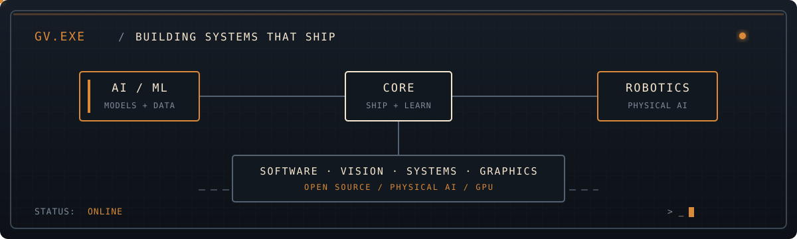
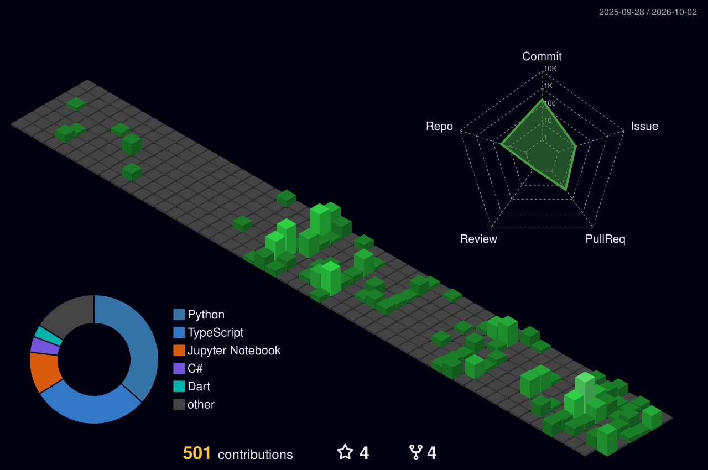

<div align="center">

<a href="https://github.com/Galabavamsi">
  
</a>

**Mechatronics undergraduate at IIT Bhilai** building across software engineering, AI/ML, computer vision, wireless systems, and GPU graphics.

[portfolio](https://galabavamsi.github.io/portfolio/) · [resume](https://galabavamsi.github.io/portfolio/resume_vamsi.pdf) · [LinkedIn](https://linkedin.com/in/galaba-vamsi-334758211) · [email](mailto:galabavamsi12@gmail.com)

[YouTube](https://www.youtube.com/@galabavamsi12) · [Google Scholar](https://scholar.google.com/citations?user=UNjZa1sAAAAJ&hl=en) · [ResearchGate](https://www.researchgate.net/profile/Galaba-Vamsi) · [IEEE Xplore](https://ieeexplore.ieee.org/author/943675488152924) · [X](https://x.com/Galaba_Vamsi) · [Human Slop](https://humanslop.in)

</div>

---

## Now

```text
FOCUS       software engineering · AI/ML research · computer vision · systems
BUILDING    Human Slop — an authenticity-first anti-AI social platform (2026–present)
OPEN TO     engineering and research roles where prototypes become products
OPEN SOURCE 8 HFlow + 2 Inspect Robots + 5 Cerulion merged PRs · 3 open Inspect Robots PRs · W&B sink published as a standalone plugin
```

## Open source

### [HFlow](https://github.com/Hebbian-Robotics/hflow) · [Hebbian Robotics (YC S26)](https://www.ycombinator.com/companies/hebbian-robotics)

Open-source robotics data processing and evaluation framework · **8 merged PRs** · **issue #656 resolved by PR #657**

<details open>
<summary>Contribution log</summary>

- [PR #657 · merged · latest](https://github.com/Hebbian-Robotics/hflow/pull/657) · [issue #656](https://github.com/Hebbian-Robotics/hflow/issues/656) — Types Arrow columns from every message, preserving fields introduced after startup and reporting incompatible shapes with topic and field context.
- [PR #598 · merged](https://github.com/Hebbian-Robotics/hflow/pull/598) · [issue #597](https://github.com/Hebbian-Robotics/hflow/issues/597) — Refused sources with multiple channels on one topic before canonical episode creation, added `hflow doctor` diagnostics for the unsupported shape, and bumped `TRANSFORM_BEHAVIOR_VERSION` to `10`.
- [PR #400 · merged](https://github.com/Hebbian-Robotics/hflow/pull/400) · [issue #399](https://github.com/Hebbian-Robotics/hflow/issues/399) — Refused LeRobot depth videos before conversion when depth markers were present, preventing the RGB H.264 path from silently losing 12-bit depth semantics while preserving the existing RGB path.
- [PR #367 · merged · featured](https://github.com/Hebbian-Robotics/hflow/pull/367) · [issue #365](https://github.com/Hebbian-Robotics/hflow/issues/365) — Added a reproducible cold `camera_frame_stats` evidence benchmark: 3 cold 1080p30 checks, 900 decoded frames each, and a 4.897 s median; separated transform timing and provenance, and documented that no repeatable semantics-preserving speedup was demonstrated, so the shipped filter graph stayed unchanged.
- [PR #362 · merged](https://github.com/Hebbian-Robotics/hflow/pull/362) — Matched saved EgoSuite labels by HFlow source provenance instead of basenames, preserving unambiguous legacy reports and rejecting ambiguous matches.
- [PR #360 · merged](https://github.com/Hebbian-Robotics/hflow/pull/360) · [issue #314](https://github.com/Hebbian-Robotics/hflow/issues/314) — Centralized ingest URI parsing across the CLI, server, and SDK with shared trimming and safety checks; normalized safe relative URIs and rejected blank, absolute, and parent-escaping paths.
- [PR #353 · merged](https://github.com/Hebbian-Robotics/hflow/pull/353) · [issue #292](https://github.com/Hebbian-Robotics/hflow/issues/292) — LeRobot video-cache filenames omitted the video file index; included the camera key, video chunk index, and video file index in cache identity and bumped the converter version to invalidate stale outputs.
- [PR #350 · merged](https://github.com/Hebbian-Robotics/hflow/pull/350) · [issue #296](https://github.com/Hebbian-Robotics/hflow/issues/296) — LeRobot’s Hugging Face tree discovery stopped after the first API page; added paginated traversal via `Link: rel="next"`, preserved request headers, deduplicated paths, rejected unsafe cross-origin links, and prevented pagination loops.

</details>

[Full HFlow contribution list](https://github.com/Hebbian-Robotics/hflow/pulls?q=is%3Apr+state%3Aclosed+author%3AGalabavamsi)

### [Inspect Robots](https://github.com/robocurve/inspect-robots) · [Robocurve (YC Summer 2026)](https://www.ycombinator.com/companies/robocurve)

MIT-licensed open-source evaluation framework for robot AI ("Inspect AI for robotics") · **2 merged PRs** · **3 open PRs awaiting merge** · **author of [inspect-robots-wandb](https://pypi.org/project/inspect-robots-wandb/) on PyPI**

<a href="https://robocurve.org/">Robocurve</a> is a San Francisco Public Benefit Corporation building open-source tools and independent benchmarks for physical AI. Every PR clears 100% coverage, strict mypy, and ruff in CI.

- [inspect-robots-wandb v0.1.0](https://pypi.org/project/inspect-robots-wandb/) · [source](https://github.com/Galabavamsi/inspect-robots-wandb) — Weights & Biases logging sink: one W&B run per evaluation with the full eval spec, trial counts, and every aggregate metric. Started as PR #434, moved to its own package at the maintainers' request; 100% coverage, CI on Python 3.10 to 3.13, PyPI trusted publishing.
- [PR #476 · merged](https://github.com/robocurve/inspect-robots/pull/476) · [issue #441](https://github.com/robocurve/inspect-robots/issues/441) — Configurable LLM retry policy across five wire protocols, honoring `Retry-After` (seconds and HTTP-date) with exponential backoff fallback, recorded in the eval log.
- [PR #475 · merged](https://github.com/robocurve/inspect-robots/pull/475) · [issue #473](https://github.com/robocurve/inspect-robots/issues/473) — Stopped an unknown working-tree state from being logged as a verified-clean commit SHA.
- [PR #514 · open, awaiting merge](https://github.com/robocurve/inspect-robots/pull/514) · [issue #136](https://github.com/robocurve/inspect-robots/issues/136) — Checkpoint and resume for long eval sets on robot hardware: single-writer manifest, immutable per-attempt logs, in-flight markers, safety aborts never auto-retried (about 4,100 lines with tests).
- [PR #550 · open, awaiting merge](https://github.com/robocurve/inspect-robots/pull/550) — Optional `on_eval_error` sink hook; approved by the automated reviewer, awaiting a maintainer.
- [PR #551 · open, awaiting merge](https://github.com/robocurve/inspect-robots/pull/551) — Community plugins section in the plugin guide.
- Co-author, submitted and under review: *Inspect Robots: Evaluating the Capabilities and Safety of Embodied AI* (CoRL 2026 Workshop SPAIS); arXiv version in preparation. [All open Inspect Robots contributions](https://github.com/robocurve/inspect-robots/pulls?q=is%3Apr+state%3Aopen+author%3AGalabavamsi)

### [Cerulion](https://github.com/cerulion-inc/cerulion)

Open-source robot runtime with ROS 2 interoperability · **5 merged PRs** · **no open PRs** · [all PRs](https://github.com/cerulion-inc/cerulion/pulls?q=is%3Apr+author%3AGalabavamsi)

- [PR #216 · merged](https://github.com/cerulion-inc/cerulion/pull/216) · issue #53 — `ros2 attach --dry-run` runs outside a workspace using an exclusively created temp root with RAII cleanup, so a pre-planted directory cannot change the report.
- [PR #226 · merged](https://github.com/cerulion-inc/cerulion/pull/226) · issue #71 — Documented the fail-closed arm of the `CERULION_NETWORK` kill-switch; review surfaced a real gap, filed as issue #239.
- [PR #224 · merged](https://github.com/cerulion-inc/cerulion/pull/224) — Fixed 21 stale `USER_API.md` references across 11 files.
- [PR #222 · merged](https://github.com/cerulion-inc/cerulion/pull/222) — ASCII punctuation in shipped doc comments (26 em dashes).
- [PR #220 · merged](https://github.com/cerulion-inc/cerulion/pull/220) — Corrected misleading workspace-root comments in `cerulion_cli_engine`.

## Selected work

| Project | What I built |
|---|---|
| [Human Slop](https://humanslop.in) | Anti-AI social platform centered on manual writing, behavioral typing signals, and authenticity-first interaction. |
| [inspect-robots-wandb](https://pypi.org/project/inspect-robots-wandb/) | Weights & Biases logging sink for the Inspect Robots evaluation framework, published on PyPI with 100% coverage and trusted publishing. |
| [Charter](https://github.com/Galabavamsi/charter) | Agentic commerce prototype with chat, voice, and MCP doors sharing a bounded Razorpay test-mode payment core. |
| [Pneumatic Sorting Digital Twin](https://github.com/Galabavamsi/pneumatic-sorting-digital-twin) | Open-source Unity digital twin for modular electropneumatic sorting and stamping workflows. |
| [HeatCast](https://github.com/Galabavamsi/heatcast) | Neighborhood heat-planning scorecard combining thermal maps, vulnerability data, indoor sites, walking routes, and planning tools. |
| [AI Village Pond Planning](https://github.com/Galabavamsi/ai-village-pond-planning) | Terrain-only API that derives pond-site and catchment recommendations from contour maps and returns GeoJSON. |
| [Arista Wi-Fi RRM](https://canva.link/puoqbe4okoid8rb) | Client-aware NS-3 RRM with 3 RF metrics, 100,000-sample I/Q captures, 16-class Dual-CNN inference, and a 5-AP / 50-client topology. |
| [AntennaNet](https://github.com/Galabavamsi/Antenna-Net) | Inverse EM design tooling with KD-tree anchoring across 144D antenna search spaces. |
| [Electron-GNN](https://github.com/Galabavamsi/Electron-GNN) | Two-tower GATv2 model for predicting molecular absorption spectra from geometry. |
| [RIS Simulator](https://github.com/Galabavamsi/RIS-SIM) | Zero-budget open-source emulator for smart radio environments and USRP-like LoS/NLoS behavior. |
| [Open-PyFX](https://github.com/Galabavamsi/open-pyfx) | GPU-accelerated video effects for CRT emulation, ASCII edge detection, and 3D LUT pipelines. |

<details>
<summary><strong>Toolbox</strong></summary>

```text
LANGUAGES   Python · Rust · C/C++ · TypeScript · JavaScript · Kotlin · Swift · Dart · Go · GLSL · CUDA
AI / ML     PyTorch · GNNs · Safe RL · Transformers · OpenCV · CuPy
PRODUCT     React · React Native · Flutter · Node.js · PostgreSQL · AWS · Supabase
SYSTEMS     Git · Linux · GitHub Actions · CI/CD · ROS 2 · MEEP · OpenMPI · SDR/USRP
```

</details>

<details>
<summary><strong>Experience & research</strong></summary>

- Marketing Intern, Swiggy Ltd - Campus CEO project, May-July 2024; managed a campaign with 15 social media posts and contributed to campus marketing initiatives and execution.
- Research intern at IIT Bhilai on 6G RIS simulation and testbed development, May–August 2025.
- First-author work: *An Open Emulator for Smart Radio Environments*.
- Co-author, submitted and under review: *Inspect Robots: Evaluating the Capabilities and Safety of Embodied AI* (CoRL 2026 Workshop SPAIS).
- 5th rank at the Arista Networks Wi-Fi Optimization Challenge, Inter IIT Tech Meet 14.0.
- Top 3.5% in the Amazon ML Challenge; accepted into YC Startup School with Human Slop.

</details>

## GitHub activity

<div align="center">

<a href="https://github.com/Galabavamsi">
  
</a>

</div>

---

<div align="center">

`build → measure → learn → ship`

</div>
